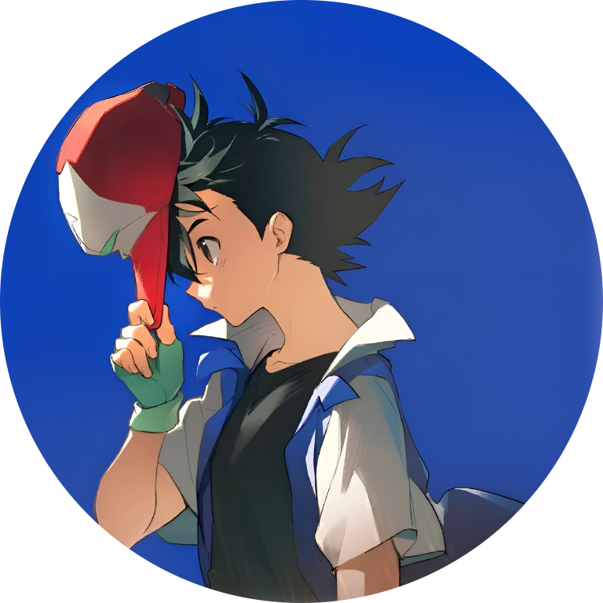

  
  

*<i>Greetings! I'm Stardust, an undergraduate mathematics student. This space serves as my academic portfolio and project repository. The works featured here primarily reflect my intellectual curiosities, coursework assignments, and practical applications of personal demand. I sincerely appreciate your patience and collaboration.</i>*

<table>
  <tr>
    <td>
      
    </td>
    <td>
      
    </td>
  </tr>
</table>

